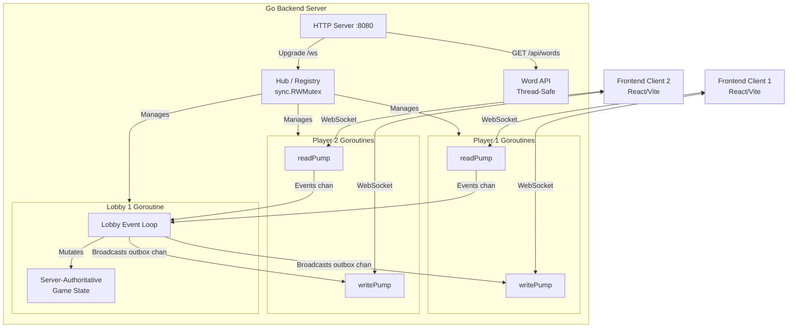

# Wordle Duel

Game Project for CS323 - Parallel and Distributed Computing

Wordle Duel is a real-time, server-authoritative multiplayer Wordle battle game. Players can create lobbies, join matches, and compete concurrently to solve the same Wordle puzzle. The architecture strictly separates the presentation layer (Frontend) from the game logic and state management (Backend), showcasing advanced parallel and distributed computing (PDC) paradigms.

---

## System Architecture

The system utilizes a distributed client-server architecture with a clear separation of concerns. 



---

## Frontend Overview

The frontend is a lightweight, responsive SPA (Single Page Application) responsible solely for rendering the UI and handling user input. 

- **Tech Stack:** React, TypeScript, Vite, TailwindCSS (or similar Vanilla CSS).
- **Functionality:** 
  - Connects to the backend via an asynchronous WebSocket stream.
  - Maintains local synchronization with the backend's server-authoritative game state.
  - Displays dynamic player leaderboards, real-time tile updates (showing opponents' progress without revealing their letters), and lobby management.

---

## Backend Overview

The backend is a highly concurrent Go application that orchestrates WebSocket connections, enforces game rules, and manages multiplayer lobbies.

- **Tech Stack:** Go, Gorilla WebSocket.
- **Functionality:**
  - **Server-Authoritative Logic:** All scoring, validation, and win-condition evaluations are computed server-side to prevent client spoofing.
  - **REST API:** Serves the valid word list and health checks.
  - **WebSocket Server:** Upgrades HTTP requests and maintains persistent bidirectional communication for real-time game events.

### Wordlist Dataset References

The embedded wordlists are sourced from:

- `possible_answers.txt` (answer pool): https://gist.github.com/cfreshman/a03ef2cba789d8cf00c08f767e0fad7b
- `allowed_guess.txt` (valid guess dictionary): https://gist.github.com/cfreshman/cdcdf777450c5b5301e439061d29694c

---

## Parallel and Distributed Computing (PDC) Concepts

This project extensively leverages PDC patterns to ensure high performance, safety, and scalability.

### 1. Data Partitioning (Sharding by Lobby)
To avoid a global state bottleneck, the game state is partitioned by **Lobbies**. 
- Each lobby encapsulates its own `GameState`, player roster, and event queue.
- This represents a form of logical sharding; an action in Lobby A has zero computational or synchronization impact on Lobby B. 
- This localized state model opens the door for horizontal scaling across distributed nodes, as lobbies act as independent execution units.

### 2. Synchronization Mechanisms
State mutation in a highly concurrent environment is carefully managed using two distinct synchronization strategies:

- **Message Passing (Channels over Locks):** Following Go's proverb ("Do not communicate by sharing memory; instead, share memory by communicating"), each lobby operates a single **Event Loop** goroutine. Player actions (e.g., `submit_guess`) are sent via a buffered channel (`lobby.events`) to the event loop. This ensures that the lobby's `GameState` is mutated sequentially, eliminating race conditions without relying on heavy lock contention.
- **Shared Memory Mutexes (`sync.RWMutex`):** For global registries (like the `Hub` tracking active clients and lobbies), read-write mutexes are used. This allows parallel reads (e.g., multiple users checking the lobby list) while safely blocking during a write (e.g., a new lobby being created).

### 3. Concurrency Model (Goroutines)
The system utilizes lightweight threads (goroutines) to handle parallel execution:
- **Per-Player Goroutines:** Every connected client spawns two dedicated goroutines: a `readPump` (for incoming WS messages) and a `writePump` (for outgoing WS messages). This allows fully asynchronous, non-blocking I/O per player.
- **Per-Lobby Goroutines:** Each lobby runs its own continuous loop, processing events and broadcasting state updates independently of other lobbies.
- **Background Workers:** TTL (Time-To-Live) caches and cleanups run in isolated background goroutines, purging inactive sessions periodically without disrupting the main execution flows.

### 4. Parallel Broadcasting
When a state update occurs in a lobby, it must be sent to all connected players. The backend utilizes `sync.WaitGroup` to fan-out broadcasts concurrently. Each player's `writePump` receives the payload via a buffered `outbox` channel (which prevents a slow client from blocking the lobby's event loop).

---

## System Functionality & Scoring

The game enforces NYT-style Wordle rules concurrently:
- 🟩 **Green (correct)**: +2 points
- 🟨 **Yellow (present)**: +1 point
- ⬛ **Grey (absent)**: +0 points
- 🏆 **Solve bonus**: +15 points

**Win Conditions:**
1. The first player to guess the word correctly wins immediately.
2. If the board fills up (nobody guesses the word), the highest total score wins.
3. If scores are tied, the match ends in a draw.

---

## Run with Docker

From the repo root:

```bash
docker compose up --build
```

Then open:

`http://localhost:5174`

## Services

- `frontend`: React app served by Nginx on host port `5174` by default (container port `80`)
- `backend`: Go API + WebSocket server (internal port `8080`)

Optional: override frontend host port with `FRONTEND_PORT`, for example:

```bash
FRONTEND_PORT=5173 docker compose up --build
```

Nginx proxies:
- `/api/*` → backend REST API
- `/ws` → backend WebSocket endpoint
